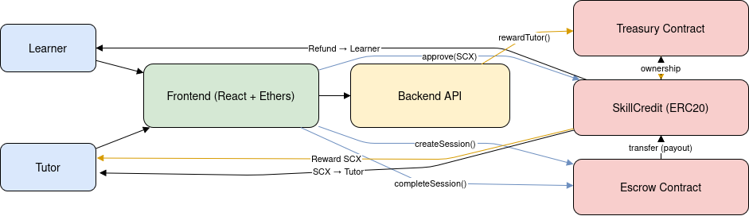

# 📜 CredLearn Blockchain Layer – Detailed Technical README

## 🧭 Introduction

This repository contains the **complete smart contract layer** for the CredLearn platform — a decentralized, credit-based peer learning marketplace.

The blockchain system is designed to:

* Enable **trustless payments** between learners and tutors
* Manage a **custom ERC20 token (Skill Credits - SCX)**
* Implement **secure escrow-based transactions**
* Separate **token logic, business logic, and payment logic** for scalability

---

# 🧱 High-Level Architecture

## 🔗 Contract Interaction Flow


---

# 🪙 1. SkillCredit (SCX Token Contract)

## 📌 Purpose

This contract implements the **native currency of the platform**.

All value transfer within CredLearn happens using SCX tokens.

---

## ⚙️ Key Features

* ERC20 standard implementation
* Mintable (controlled supply)
* Burnable (for spending credits)
* Compatible with wallets (MetaMask)

---

## 🧩 Core Responsibilities

### 1. Maintain balances

Tracks how many tokens each user owns.

### 2. Transfer tokens

Allows peer-to-peer transfer of credits.

### 3. Mint tokens

Creates new tokens (used for rewarding tutors).

### 4. Burn tokens

Destroys tokens (used when credits are spent).

---

## 🔐 Access Control

* Only the **owner (Treasury contract)** can mint tokens
* Any user can burn their own tokens

---

## 🔁 Token Flow

### Minting Flow

```
Treasury → mint() → User receives SCX
```

### Spending Flow

```
User → burn() OR transfer() → Tokens deducted
```

---

# 🏦 2. Treasury Contract

## 📌 Purpose

The Treasury contract handles **platform-level economics and rewards**.

It acts as the **controller of token issuance**.

---

## ⚙️ Responsibilities

### 1. Reward Tutors

Mint SCX tokens to tutors based on completed sessions.

### 2. Handle Platform Fees

Deduct a percentage from rewards.

### 3. Store Fees

Accumulate platform revenue in SCX.

### 4. Withdraw Fees

Allow admin to withdraw collected fees.

---

## 🔐 Access Control

* Only the **owner (backend/admin)** can call reward functions
* Prevents unauthorized minting

---

## 💰 Reward Flow

### Without Fee

```
Treasury → mint(tutor, amount)
```

### With Fee

```
amount = 100
fee = 5

Tutor receives → 95
Treasury keeps → 5
```

---

## ⚠️ Important Design Decision

Ownership of the **SkillCredit contract must be transferred to Treasury**.

```
scx.transferOwnership(treasuryAddress)
```

Without this:

* Treasury cannot mint tokens ❌

---

# 🤝 3. Escrow Contract

## 📌 Purpose

The Escrow contract enables **trustless transactions** between learners and tutors.

It ensures:

* Funds are locked before session starts
* Funds are only released after completion
* Refunds are possible

---

## 🧩 Session Model

Each learning interaction is stored as a **Session struct**:

```
struct Session {
    address learner;
    address tutor;
    uint256 amount;
    bool completed;
    bool refunded;
}
```

---

## ⚙️ Responsibilities

### 1. Lock Funds

Transfers SCX from learner to escrow contract.

### 2. Release Funds

Transfers SCX to tutor after completion.

### 3. Refund Funds

Returns SCX to learner if session fails.

---

## 🔁 Complete Flow

### Step 1: Approval

User must approve escrow contract:

```
approve(escrow, amount)
```

---

### Step 2: Create Session

```
createSession(tutor, amount)
```

Effects:

* Tokens transferred to escrow
* Session created

---

### Step 3A: Complete Session

```
completeSession(sessionId)
```

Effects:

* Tokens transferred to tutor
* Session marked completed

---

### Step 3B: Refund Session

```
refundSession(sessionId)
```

Effects:

* Tokens returned to learner
* Session marked refunded

---

## 🔐 Access Rules

| Action          | Allowed By |
| --------------- | ---------- |
| createSession   | learner    |
| completeSession | learner    |
| refundSession   | tutor      |

---

## ⚠️ Security Guarantees

* No double completion
* No double refund
* Funds cannot be stolen
* Only valid participants can act

---

# 🔄 End-to-End System Flow

## 🎓 Learning Session Lifecycle

```
1. Tutor teaches session (off-chain)

2. Learner approves tokens
   ↓
3. Escrow.createSession()
   → funds locked

4. Session happens (off-chain)

5A. Learner completes
   → tutor paid

OR

5B. Tutor refunds
   → learner refunded
```

---

# 🧠 Design Principles

## 1. Separation of Concerns

| Contract    | Responsibility |
| ----------- | -------------- |
| SkillCredit | Token logic    |
| Treasury    | Economic logic |
| Escrow      | Payment logic  |

---

## 2. Modularity

Each contract can evolve independently.

---

## 3. Security First

* Uses OpenZeppelin standards
* Avoids manual token logic
* Prevents unauthorized actions

---

## 4. Trustless Execution

No central authority required for payments.

---

# 🧪 Testing Strategy

The system is tested using:

* Hardhat v3
* Ethers v6
* Chai assertions

---

## 🔍 What is Tested

### SkillCredit

* Minting
* Burning
* Transfers
* Access control

### Treasury

* Reward distribution
* Fee logic
* Owner restrictions

### Escrow

* Fund locking
* Completion flow
* Refund flow
* Edge cases

---

# 🚀 Future Improvements

## 1. Dispute Resolver (DAO Voting)

* Decentralized conflict resolution
* Community voting

## 2. Reputation System

* Score tutors and learners

## 3. Staking Mechanism

* Lock tokens for credibility

## 4. Upgradeable Contracts

* Proxy pattern

---

# 🧾 Summary

The CredLearn blockchain layer provides:

* A **secure token economy (SCX)**
* A **controlled reward system (Treasury)**
* A **trustless payment mechanism (Escrow)**

Together, these components form a **scalable, modular, and production-ready Web3 backend** for a peer learning marketplace.

---

# 🧠 Key Takeaway

> This system eliminates trust assumptions by enforcing all financial interactions through smart contracts, ensuring fairness, transparency, and security.

---

# 👨‍💻 Author
> Mohd Adnan Malik  

Built as part of a B.Tech Final Year Project.
